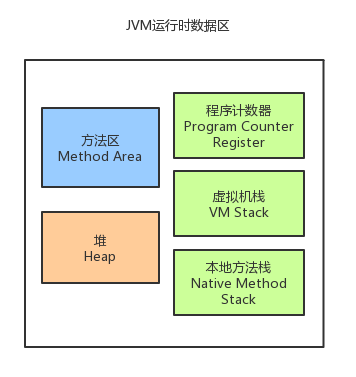

## JVM 面试

### 1.7 1.8 HotSopt JVM 变化

1.7 中使用永久代实现方法区，存储class类元信息（class对象，字面常量等）和字符串常量

1.8 中使用元数据区实现方法区，存储class类元信息，把字符串常量移动到堆中，此外，元数据区不占用JVM内存，而是直接存储于本地内存中。（好处是防止字符串常量过多造成的方法区内存溢出）

### JVM 内存模型示意图

### HotSpot 堆内存模型

分配占比： 新生代 1/3 老年代 2/3
eden区、from（s0）、to(s1) 默认比例为 8：1：1

### 对象进入老年代的时机:

- survivor 区内存不够时
- 为大对象申请内存时,直接分配在老年代
- 在survivor区存活时间超过阈值时

### GC的类型：
（1）对新生代的对象的收集称为minor GC；复制清除算法,即将 Eden 和 from 拷贝到 to, 然后清除 Eden和 from, 时机: Eden 不足时
（2）对旧生代的对象的收集称为Full GC；标记整理算法(标记-移动-清理), 标记清除算法(标记-清理), 时机: 老年代或者方法区不足时
（3）程序中主动调用System.gc()强制执行的GC为Full GC。

### 对象的四种引用类型：
（1）强引用：默认情况下，对象采用的均为强引用（这个对象的实例没有其他对象引用，GC时才会被回收）
（2）软引用：软引用是Java中提供的一种比较适合于缓存场景的应用（只有在内存不够用的情况下才会被GC）
（3）弱引用：在GC时一定会被GC回收
（4）虚引用：由于虚引用只是用来得知对象是否被GC

### GC 回收过程:

1. 可达性分析

   - GC Roots包括：

     - 虚拟机栈中引用的对象。

     - 方法区中类静态属性实体引用的对象。

     - 方法区中常量引用的对象。

     - 本地方法栈中JNI引用的对象。

2. 第一次回收,调用 finalize()方法,但不清理内存    注: finalize 只会被执行一次

3. 再次回收,释放内存

### GC 垃圾回收器实现:

新生代: Serial, ParNew, Parallel Scavenge(**可控吞吐量**)

老年代 Serial old ,Parallel Old: 老年代 标记整理算法

老年代 CMS: 并发标记清除算法(三色标记, **减少时停**,但是由于和业务线程并发,会降低吞吐量). JDK 9 废弃

全能: G1: 将内存化为 等大 **region**, 标记每一小格属于什么类型, **老年代回收时做 并行标记(快照) 新生代回收做并行复制 + 对老年代的整理, 可以控制最大时停时间**

## 类加载

双亲委派:

​	简单来说就是加载类时,优先由父加载器加载, 父加载器找不到类, 再交给子加载器去加载,目的是防止系统关键类被替换或篡改
