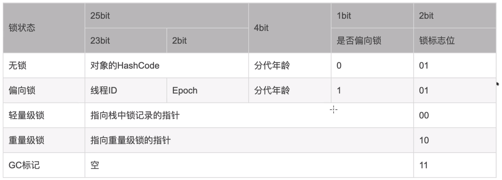

[toc]

# Synchronize 机制

## 对象 对象头

## Synchronize

Java 6 之前
编译后 为 monitorenter , monitorexit 指令 由操作系统的 mutex lock 指令实现

Jvaa 6 引入

| 锁状态   | mark word | 机制                                                                                                                                                        |
| -------- | --------- | ----------------------------------------------------------------------------------------------------------------------------------------------------------- |
| 无锁     | 001       |                                                                                                                                                             |
| 偏向锁   | 101       | 比对线程 ID， 有竞争时升级为轻量级锁                                                                                                                        |
| 轻量级锁 | 00        | 指向线程私有虚拟机栈中锁记录的指针,结构为 Lock Record{ Mark Word \| Onwer -> Onject } 此时，线程 CAS 自选去尝试获取锁， 等待线程超过 1 个时，升级为重量级锁 |
| 重量级锁 | 10        | 指向重量级锁的指针                                                                                                                                          |
| GC       | 11        |                                                                                                                                                             |

# JUC 包

## 无锁编程 CAS

目的：减少用户态/内核态的切换，提高多线程并发效率

由 cpu 指令保证 compare and swap 的原子性： x86: cmpxchg ARM: LL/SC

实现类： AtomicXXX 类

实现方法：
> Unsafe 类的CAS原子操作 以及 voloatile long offset 做线程可见

## [AQS](./AQS.md)

## [ReentrantLock](./ReentrantLock.md)

## [CountDownLatch](./CountDownLatch.md)

## [ConcurrentHashMap](./ConcurrentHashMap.md)