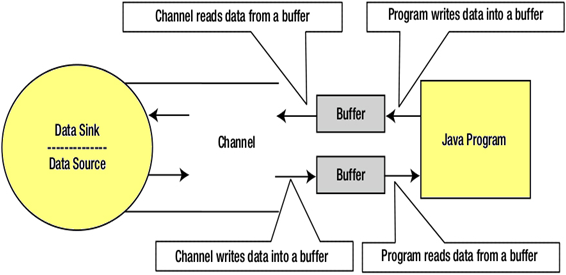

[toc]
### NIO 包结构


| 包名称                  | 使用/目的                                                                    |
| :---------------------- | :--------------------------------------------------------------------------- |
| java.nio                | 它是 NIO 系统的顶级包，NIO 系统封装了各种类型的缓冲区。                      |
| java.nio.charset        | 它封装了字符集，并且还支持分别将字符转换为字节和字节到编码器和解码器的操作。 |
| java.nio.charset.spi    | 它支持字符集服务提供者                                                       |
| java.nio.channels       | 它支持通道，这些通道本质上是打开 I/O 连接。                                  |
| java.nio.channels.spi   | 它支持频道的服务提供者                                                       |
| java.nio.file           | 它提供对文件的支持                                                           |
| java.nio.file.spi       | 它支持文件系统的服务提供者                                                   |
| java.nio.file.attribute | 它提供对文件属性的支持                                                       |

----
### IO 包和 NIO 包的区别

|        IO        |             NIO              |
| :--------------: | :--------------------------: |
|  阻塞 I/O 操作   |       非阻塞 I/O 操作        |
| 面向流(Stream)的 | 面向缓存(Channel & Buffer)的 |
|    通道不可用    |  通道可用于非阻塞 I/O 操作   |
|   选择器不可用   | 选择器可用于非阻塞 I/O 操作  |

----

### Channel



channel 可以双向作为 文件/设备/网络 和 buffer 之间的传输媒介，通常与操作系统文件描述符具有一对一关系，用于提供平台独立操作功能。

Channel 接口方法：
close();
isOpen();

实现类常用方法：
write();
read();

----
### Buffer
Buffer 的属性：
capacity: 容量
limit: 游标
position: 当前位置
mark: 复位位置标记

```java
//methods:
allocate(int capacity);         // 分配J在VM内存， 数据量大师性能更好， 数据量小时性能略低可以忽略
allocateDirect(int capacity);   // 分配在系统内存， 因为分配系统级内存比分配JVM内存更耗时间

capacity();
limit();
limit(int newLimit);
position();
mark();

clear(); // limit = capacity, position = 0;
filp(); // limmit = position, position = 0;
rewind();// unchange limit, position = 0; for re-read/write
reset();// position = mark;

get();
put();
order(ByteOrder bo); //设置大端小端模式
```

----
### Channel 实现类

FileChannel:

```java
String relativelyPath = System.getProperty("user.dir");
FileInputStream input = new FileInputStream(relativelyPath + "/testin.txt");
ReadableByteChannel src = input.getChannel();
FileOutputStream output = new FileOutputStream(relativelyPath + "/testout.txt");
WritableByteChannel dest = output.getChannel();

ByteBuffer buffer = ByteBuffer.allocateDirect(20 * 1024);// 20 MB
while (src.read(buffer) != -1) {
    // The buffer is used to drained
    buffer.flip();
    // keep sure that buffer was fully drained
    while (buffer.hasRemaining()) {
        dest.write(buffer);
    }
    buffer.clear(); // Now the buffer is empty, ready for the filling
}

//methods:
read();
wirte();
size();
transforFrom(ReadableChannel src, long position, long count);
transforTo(long position, long count, WritableChannel target);
position();
truncate(long size);
open();
map();
lock();
tryLock();
```

DatagramChannel：//for UDP

```java
DatagramChannel ch = DatagramChannel.open();
DatagramChannel ch = DatagramChannel.close();
//methods:
bind(SocketAddress local);
connect(SocketAddress remote);
disconnect();
isConnected();
getLocalAddress();
getRemoteAddress();
socket();
validOps();

open();
read(ByteBuffer dst);
write(ByteBuffer src);
receive(ByteBuffer dst);
send(ByteBuffer src);
setOption(SocketOption<T> name, T value);
```

SocketChannel: // for TCP

```java
SocketChannel ch = SocketChannel.open();
ch.connect(new InetSocketAddress("somehost", someport));

SocketChannel ch = SocketChannel.close();
ch.connect(new InetSocketAddress("somehost", someport));

//methods:
bind(SocketAddress local);
connect(SocketAddress remote);
finishConnect();
getLocalAddress();
getRemoteAddress();
isConnected();
shutDownInput();
shutDownOutput();
socket();
validOps();

open(SocketAddress remote);
read(ByteBuffer dst);
write(ByteBuffer src);
setOption(SocketOption<T> name, T value);
```


----
### Selector

用于单线程中处理多个 channel,即多路复用器.通过减少线程，继而减少线程切换所带来的开销，提高性能。

selector通过 open()/openSelector() 方法开启，SelectableChannel(要求非阻塞) 通过 register()方法注册到Selector，并指定自己的 intsert set (int 型 可通过位运算得到不同操作的并集)
Selector通过select()/selecNow()查询可用的通道数量，之后可用selectKeys()得到可用的SelectionKey对象。
返回可用通道Set.


SelectKey 方法():
```java
key.attachment(); //返回SelectionKey的attachment，attachment可以在注册channel的时候指定。通过key.attach(theObject)将Object绑定在Key上;
key.channel(); // 返回该SelectionKey对应的channel。
key.selector(); // 返回该SelectionKey对应的Selector。
key.interestOps(); //返回代表需要Selector监控的IO操作的bit mask
key.readyOps(); // 返回一个bit mask，代表在相应channel上可以进行的IO操作。

// 查询通道是否对 某操作 就绪
boolean isAcceptable();//是否可读，是返回 true
boolean isWritable()：//是否可写，是返回 true
boolean isConnectable()：//是否可连接，是返回 true
boolean isAcceptable()：//是否可接收，是返回 true
```

Selector维护的三个集合
- key set          : 由keys()方法返回，表示注册到Selector的通道；
- selected key set : 由selectedKeys()返回,表示当前可用通道集合；
- cancelled key set: 不可用但是还未在Selector中注销的通道

select操作 返回的是自上次调用select()方法 到 本时刻进入就绪状态的通道数量

**注： Selector是线程安全的，但是SelectionKey不是**

selector 代码示例：

```java
ServerSocketChannel ssc = ServerSocketChannel.open();
ssc.socket().bind(new InetSocketAddress("localhost", 8080));
ssc.configureBlocking(false);

Selector selector = Selector.open(); // 开启selector
ssc.register(selector, SelectionKey.OP_ACCEPT); // 注册

while(true) {
    int readyNum = selector.select();
    if (readyNum == 0) {
        continue;
    }

    Set<SelectionKey> selectedKeys = selector.selectedKeys(); // 获取SelectionKeys
    Iterator<SelectionKey> it = selectedKeys.iterator(); // 获取遍历器

    while(it.hasNext()) {
        SelectionKey key = it.next();
        // 根据不同就绪状态做不同操作
        if(key.isAcceptable()) {
            // 接受连接
        } else if (key.isReadable()) {
            // 通道可读
        } else if (key.isWritable()) {
            // 通道可写
        }

        it.remove();
    }
}
```

----

### Pipe

连接两个通道(可在不同线程里)
数据从source 读取， 写入 sink

```java
static Pipe	open() //Opens a pipe.
abstract Pipe.SinkChannel	sink() // Returns this pipe's sink channel.
abstract Pipe.SourceChannel	source() //Returns this pipe's source channel.
```

----

### NIO 编码/解码

- CharsetEncoder 将unicode 编码为 字节流序列 放入 ByteBuffer
- CharsetDecoder 将字节序列解码后传入 CharBuffer

```java
Charset cs = Charset.forName("UTF-8");
CharsetDecoder csdecoder = cs.newDecoder();
CharsetEncoder csencoder = cs.newEncoder();
String st = "Example of Encode and Decode in Java NIO.";
ByteBuffer bb = ByteBuffer.wrap(st.getBytes());
CharBuffer cb = csdecoder.decode(bb);
ByteBuffer newbb = csencoder.encode(cb);
```

----
### FileLock

由 FileChannel 或 AsynchronousFileChannel 的 lock() 或 tryLock() 返回
```java
FileLock.lock(long position, long size, boolean shared);
FileLock.tryLock(long position, long size, boolean shared); // return null for fail
```


