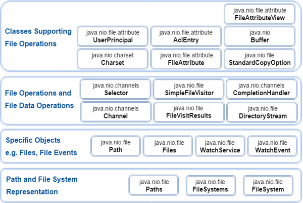

### NIO 包结构

| 包名称   | 使用/目的                                               |
| :------- | :------------------------------------------------------ |
| java.nio | 它是 NIO 系统的顶级包，NIO 系统封装了各种类型的缓冲区。 |
| java.nio.charset | 它封装了字符集，并且还支持分别将字符转换为字节和字节到编码器和解码器的操作。 |
| java.nio.charset.spi | 它支持字符集服务提供者 |
| java.nio.channels | 它支持通道，这些通道本质上是打开 I/O 连接。 |
| java.nio.channels.spi | 它支持频道的服务提供者 |
| java.nio.file | 它提供对文件的支持 |
| java.nio.file.spi | 它支持文件系统的服务提供者 |
| java.nio.file.attribute | 它提供对文件属性的支持 |

### IO包和NIO包的区别

IO包 NIO包 最主要的区别在于