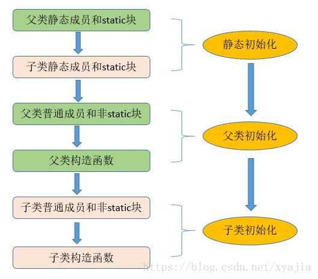

## 类初始化顺序



测试代码：

```java
// 类初始化顺序
public class InitialOrderTest {   
  
    // 静态变量 
  
    public static String staticField = "静态变量";
  
    // 变量 
    public String field = "变量";   
  
    // 静态初始化块 
    static {   
        System.out.println(staticField);   
        System.out.println("静态初始化块");   
    }   
  
    // 初始化块 
    {   
        System.out.println(field);   
        System.out.println("初始化块");   
    }   
  
    // 构造器 
    public InitialOrderTest() {   
        System.out.println("构造器");   
    }   
  
    public static void main(String[] args) {
        new InitialOrderTest();   
    }   
}

// 结果
// 静态变量
// 静态初始化块
// 变量
// 初始化块
// 构造器


// 父类子类初始化顺序
class Parent {   
    // 静态变量 
    public static String p_StaticField = "父类--静态变量";
    protected int i = 1;
    protected int j = 8;
    // 变量 
    public String p_Field = "父类--变量";   
  
    // 静态初始化块 
    static {   
        System.out.println(p_StaticField);   
        System.out.println("父类--静态初始化块");   
    }   
  
    // 初始化块 
    {   
        System.out.println(p_Field);   
        System.out.println("父类--初始化块");   
    }   
  
    // 构造器 
    public Parent() {   
        System.out.println("父类--构造器"); 
        System.out.println("i=" + i + ", j=" + j);
        j = 9;
    }   
}   
  
public class SubClass extends Parent {
  
    // 静态变量 
    public static String s_StaticField = "子类--静态变量";
  
    // 变量 
    public String s_Field = "子类--变量";   
    
    // 静态初始化块 
    static {   
        System.out.println(s_StaticField);   
        System.out.println("子类--静态初始化块");   
    }   
    // 初始化块 
    {   
        System.out.println(s_Field);   
        System.out.println("子类--初始化块");   
    }   
  
    // 构造器 
    public SubClass() {   
        System.out.println("子类--构造器"); 
        System.out.println("i=" + i + ",j=" + j);
    }   
  
    // 程序入口 
    public static void main(String[] args) {
        new SubClass();   
    }   
}  

//结果
// 父静态初始化块/成员
// 子静态初始化块/成员

// 父初始化块/成员
// 父构造器

// 子初始化块/成员
// 子构造器

```

