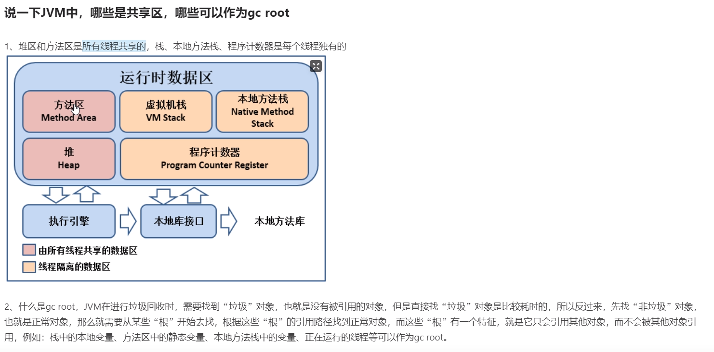

## 

### [ThreadLocal相关](./面试题part/ThreadLocal.md)

### JVM中那些是共享区，那些可以作为GC ROOT


共享区即所有线程都可以访问的内存区域，也就是 **堆** 和 **方法区**
而 **虚拟机栈（存储栈帧）**、**本地方法区（存储本地方法引用）**，**程序计数器（每个线程都有自己独有的程序计数器）** 为各个**线程独有**的

GC为从GC root 开始，寻找有用的对象，主流的算法为三色标记算法等，而无用对象的内存会被垃圾回收器释放。GC root即为那些对象引用树的根，这些GC root 即为包含其他对象的引用，而不被其他对象引用的对象。
gc root 包括栈中的本地变量，方法区的静态变量、本地方法栈中的变量、正在运行的线程

### 如何排查JVM问题
**对于正在正常运行的系统：**
- jmap 查看各个内存区域的使用情况
- jstack 查看线程运行情况， 例如 阻塞，死锁等
- jstat 查看垃圾回收情况，看 full gc 是否过于频繁
- 对于full gc 过于频繁导致 stop the world 时间过长，但是又没有OOM发生的情况：考虑是否某些对象过大,未分配在新生代，直接分配到老年代，且存活时间不长，导致full gc 频繁。这种情况可以考虑 
  1. 看看是否能避免这些对象的创建，或者是否能拆分成小对象. 
  2. 适当调整JVM内存尤其是新生代的大小，使得在这些对象可以被分配在新生代中，由young gc回收
- 另外还可以监测cpu占用过多的线程，定位到具体方法，查看是否可以优化。
- 以及查找是否创建了不必要的对象，导致内存占用过多

**对于已经发生OOM的系统**
- 查看当时的dump文件 -XX:+HeapDumpOnOutMemoryError -XX:HeapDumpPath=/usr/local/base
- jsisualvm等工具分析dump文件
- 根据dump文件，找到异常线程、实例对象，并定位到具体的代码， （代码问题，内存泄漏，流量过大（可以设置限流）等）
- 分析、修改、调试、测试

### 如何查看线程死锁
1. jstack 查看线程死锁情况
2. 查看是否数据发生了死锁
    ```sql
    ## 查询是否锁表
    show OPEN TABLES where In_use > 0;
    ## 查询进程
    show processlist
    ## 查看持有锁的事务
    SELECT * FROM INFOMATION_SCHEMA.INNODB_LOCKS;
    ## 查看等待锁的事物
    SELECT * FROM INFOMATION_SCHEMA.INNODB_LOCKS_WAITS;
    ```

### 线程通讯
1. 同机 共享内存， 同步需要控制阻塞、唤醒、并发
2. 通过网络接口

### Spring 大致流程
[Spring流程]()