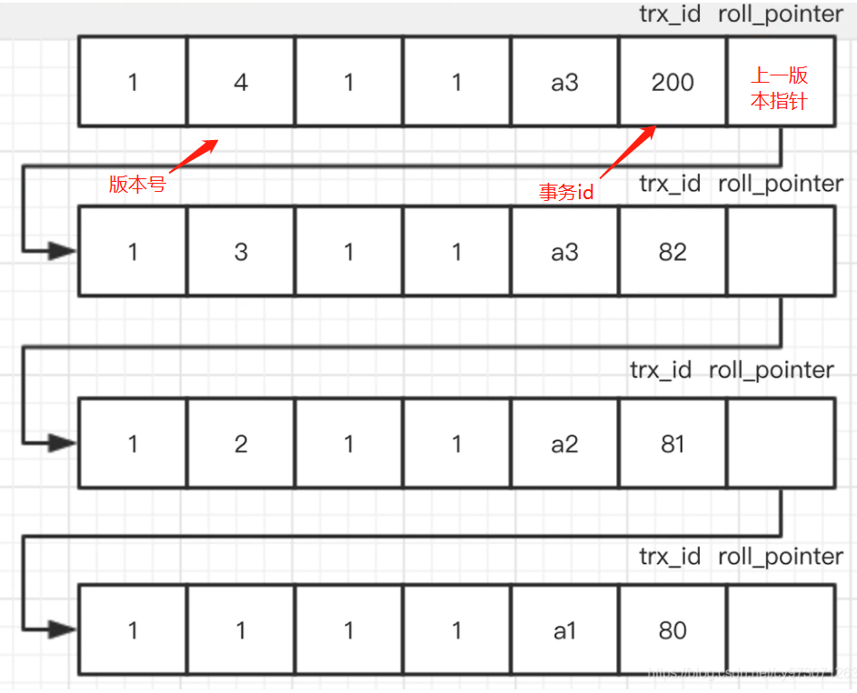

mysql.md
## Win 下的安装
1. 解压
2. 配置环境变量
3. 配置my.ini
4. mysqld --initialize-insecure 初始化mysql(无初始密码) mysqld --initialize --console (屏显初始密码)
5. mysqld --install 注册服务
6. net start mysql 启动服务 

## 常用命令

### 登陆
mysql -uroot -p

### 修改密码
mysql> alter user 'root'@'localhost' identified by '123456';
mysql> flush privileges;

### 备份
mysqldump -u[uname] -p[pass] [dbname] > [backupfile].sql

### 导入
mysql -u[uname] -p[pass] [dbname] < [backupfile].sql

TIMESTAMP column with CURRENT_TIMESTAMP 问题： --> 升级到5.5以上

## MySQ逻辑架构

连接层 jdbc odbc 等等连接(池)技术 

服务层 api, sql解析, sql优化等

引擎层 不同的数据库引擎,插件式

存储层 底层文件存储

## MyISAM 和 InnoDB 区别

|          | MyISAM                           | InnoDB                           |
| -------- | -------------------------------- | -------------------------------- |
| 外键     | 不支持                           | 支持                             |
| 事务     | 不支持                           | 支持                             |
| 行锁     | 不支持                           | 支持                             |
| 缓存     | 只缓存索引不缓存数据             | 索引和数据都缓存, 对内存要求较高 |
| 表空间   | 小                               | 大                               |
| 关注点   | 性能 偏读写                      | 事务                             |
| 索引类型 | 非聚族索引(叶子节点存数据的指针) | 聚族索引(数据放在叶子节点块)     |

注: InnoDB 的行锁是基于索引实现的, 锁分为三种 行锁: Record Lock,  间隙锁: Gap Lock ，锁定一个范围，但不包含本身.   Next-Key Lock : 锁定一个范围,并且锁定记录本身

## 聚族索引的优缺点

优点:

- 数据和索引一起加载到内存, 大多数情况下可以减少磁盘IO
- 移动数据行时只维护主索引, 不用再维护辅助索引
- 适合排序, 因为数据的物理存放顺序和索引是一致的

缺点:

- 辅助索引(二级索引)需要去主索引在查找一次来获取数据

==注: 因为InnoDB 聚族索引的使用, 所以主索引(主键) 最好为自增, 使得数据插入不会对索引树产生较多的分裂和移动操作.==

==比较好的选择是 雪花算法, 既保证全局唯一,又保证单调性==

## ==数据库隔离级别==

- ==读未提交==
- ==读已提交==: (快照读) ==Oracle, Sql Server==
  - 可以防止脏读
- ==可重复读==: ==Mysql== MVCC（多版本并发控制）一个事务开始，会得到相应的版本号，在这个事务里面读同一个版本号的同一个数据，都是相同的，解决不可重复读。
  - 防止脏读和不可重复读(事务中别的事务提交了update,导致两次读取的数据不一致)
- ==串行化==
  - 防止脏读,不可重复读,幻读(两次读取之间,别的事务进行了 insert delete 导致两次读取集合的数量不同)
  - 效率极低, 完全不支持并发

## ==MVCC 并发版本控制==

MVCC 的好处, 区别读写操作, 快照读 for read, 当前读 for write. 提高读写操作并发度, 写操作可以不用等待读操作完成.(因为读操作会去找对应的版本号记录)

## ==ReadView 实现事务隔离==

==每个事务持有一个 ReadView, ReadView 只在 读操作时创建, 增删改 不会创建 ReadView.==

### ReadView 结构

- m_ids: 生成 ReadView 时, 所有未提交的事务id。
- min_trx_id：生成ReadView时 最小的事务id，也就是m_ids中的最小值。 就是还未提交的事务中最老的一个事务。-
- max_trx_id：生成ReadView时 系统中应该分配给下一个事务的id值。>= 这个值说明该事务的创建 晚于 这个ReadView. 
- creator_trx_id：生成该ReadView的事务id。

### ReadView 作用

==与 版本链中的 trx_id 对比, 用来判定持有 ReadView 的事务是否可以读取这个版本的内容.==

判断条件:

- trx_id == creator_trx_id, 表示这个版本是当前事务修改的, 当前事务可见
- trx_id < min_trx_id, 表示 ReadView 创建时, 该版本已提交, 当前事务可见
- trx_id >= max_trx_id, 表示 ReadView 创建时, 创建该版本的事务还未开启, 当前事务不可见
- trx_id >= min_trx_id 且 < max_trx_id, 看 trx_id 是否在 m_ids 中, 如果存在, 则说明创建版本的事务还未提交, 当前事务不可见. 如果不存在,则说明创建版本的事务已经提交, 当前事务可见.

### ==事务隔离级别的实现==:

在读未提交级别时: 直接读最新版本, 即头指针所在节点数据

读已提交级别时: 每次读取都创建新的 ReadView, 读取时,从版本链往下找可以读取的版本

可重复读级别时: 读操作去找自己的版本号来读, 即 ==快照读==, 增删改 时 从最新的数据改, 即 从==当前版本改==, 以此来保证并发事务的数据一致性.

​							其实现为 事务第一次 读取时 创建 ReadView, 以后每次读取都使用这个 ReadView.

串行化级别时: 事务对当前所有获取过数据的表==加表锁==, 在事务未提交前, 不允许其他事务更改数据, (读可以,改得等前一个事务提交才行)

==注: 对于幻读, mysql innodb **使用间隙锁(防止在间隙之间插入数据)** 和 **mvcc 的快照读(防止幻读), 当前版本改(为了保证数据一致性,且改操作会加锁,这里是next-key,即索引范围,加上两侧的间隙锁,如果没走索引的话,则会每行都加锁,相当于表锁,使得其他线程的修改被阻塞,以此来解决幻读问题. 如果没有锁的话, 其他线程的新增操作在原线程的修改操作前commit, 则会出现经典的幻读)** 来解决了绝大多数的幻读==

另注: InnoDB下 间隙锁的产生条件:

当我们用范围条件条件检索数据（非聚簇索引、非唯一索引），并请求共享或排他锁时，InnoDB会给符合条件的数据记录的索引项加锁；对于键值在条件范围内但并不存在的记录，称为间隙，InnoDB也会为这些间隙加锁，即***间隙锁***。

- 隔离级别为RR
- 当前读, (在RR下, 即为 增删改操作)
- 查询条件能够走到索引 (1,对查询条件范围内加锁, 无论存在与否, 2, 若不走索引则无间隙锁)

## SQL 执行顺序

FROM

ON

​	JOIN

WHERE

GROUP BY

HAVING

SELECT

DISTINCT

ORDER BY

LIMIT

## 七(五)种 JOIN

- LEFT JOIN
  - ON A.Key = B.key   ====> 全A
  - ON B.key = NULL   ====> A但是不包含与B的交集, 即 A-B
- RIGHT JOIN
  - ON A.key = B.key	 ====> 全B
  - ON A.key = NULL     ====> B但是不包含与A的交集, 即, B-A
- INNER JOIN     ====> AB 交集

- FULL OUTER JOIN  (MySQL没有)
  - ON A.key = B.key  ====> 全集
  - ON A.key = NULL OR B.key = NULL   ====> 全集不包含AB交集

## 索引

优势: 排序已经做好, 提高==查找==和==排序==的效率

缺点: 增删改需要维护索引, 效率降低

需要索引的字段: 

- 常用的查询字段和排序字段适合建立索引(多字段联合的可以做复合索引) 

- 用于group by 的字段适合建立索引

- 除了必要的场景, 一张表最好不建多余的索引, 

不适合建立索引的字段: 

- 经常改动的字段, 

- 不用于查询条件的字段
- 重复内容过多的字段

### 索引分类

按键的数量分类:

- 单值索引: 建立在单字段上的索引
- 复合索引: 多字段联合索引

按唯一性分类:

- 唯一索引: 索引必须唯一, 但是允许空

特殊分类:

- 主键索引: (InnoDB) 
  - 主键索引 是 聚族索引, **叶子节点带数据**, 而一般的索引是非聚族索引, **叶子节点记录主键值,** 需要回表, 从主键索引再走一遍, 以查找数据, 使用一般索引时, 最好查找的字段都被索引覆盖, 这样就不用再回主表去搜索了.
  - 主键索引不允许为空, 普通索引可以有空值, 唯一索引允许有空值
  - 主键还经常和外键构成参照完整性约束
  - 另外, 一张表里 主键索引只有一个, 其他的唯一索引可以有多个

## ==慢sql排查:==

- 执行时间长
  - sql 烂
  - 未击中索引
    - 索引失效
  - 关联join多
  - 服务器调优, (缓冲,线程池,硬件)
- 等待时间长 --> 其他问题
  - 传输数据多,网络慢
  - 磁盘占用高
  - ...

## Explain 详解

- ==id:==
  - 表示 表的加载顺序, id 越大越先加载 相同 id 从上到下执行

- select_type:
  - SIMPLE: 简单查询, 不包含子查询, 不包含 UNION
  - PRIMARY : where子句 有子查询 或者 UNION 时, 最外层的 SELECT
  - SUBQUERY 子查询(SELECT 或者 WHERE　语句中)
  - DERIVED 衍生表(临时表)
  - UNION -- 联合查询　被 UNION 的表, 若UNION 在FROM子句的子查询中, 则外层被标记为 DERIVED 
  - UNION RESULT: 从 UNION 表获取结果的 SELECT
- table:
  - 加载的表
- ==type:== 访问类型 从上到下性能越来越差, 一般至少 range, 最好在 ref 以上
  - system : 单表单行
  - const: 唯一索引 = 固定值
  - eq_ref: 查询和比对的所有字段 都是 唯一索引
  - ref: 非唯一索引 = 某值, 查询出特定的一组行, 然后扫描
  - fulltext: 全文检索, 需要 FULLTEXT 类型索引支持 用于 REGEXP MATCH() against() 模糊匹配
  - range: 索引在一定范围内查找, 一般 >, <, between, in 这种 
  - index: 全索引扫描, 因为索引文件比数据文件小得多, 所以比全表扫描好
  - ALL: 全表扫描
- possible_keys
  - 可能可以用到的索引
- ==key==
  - 实际用到的索引 (注: 无where子句,但是select 的字段 刚好符合索引时, 会用到覆盖索引, 会出现possible_keys 为 null, 但是  key 有用到索引, 相当于不需要回表扫描)
- key_len
  - 索引使用的字节数, 这里显示的是最大可能长度, 并非实际使用长度, 即, 根据表定义来计算出的长度
- ref
  - 显示用到了那些字段被用于和索引进行对比, 一般为 字段名, const, func, null
- ==rows==
  - 需要查找行数的一个预估值
- ==Extra== 其余可能很重要的信息 
  - 例如 Using index, 表示只用索引就完成了查询, 没有回表, 一般意味着性能很好
  - Using where, 表示使用了 WHERE 做过滤
  - Using temporary, 表示需要创建临时表, 常见于 order by, group by,  需要建立索引并优化
  - Using filesort, 表示使用了外部排序, 一般是由于 排序的字段 没有索引, 需要建立索引并优化
  - Using Join Buffer: 表示 join 比较多, 可以调大缓冲区的 join buffer
  - impossible where: where 匹配不到任何东西
  - distinct: 表示找到了匹配行后,就不再搜索了, 就是用了 DISTINCT 关键字

## profile 分析

开启:

​	set profiling=on;

查询:

​	show profiles;

查询具体sql:

​	show profile cpu, block io for query 1

## ==索引什么时候会失效==

- **最左匹配原则, 联合索引 如果从左开始缺少某些 索引列, 则无法使用这个联合索引**
- **联合索引 使用范围查询时, 范围查询条件右侧的 索引列失效**
- **like 查询如果用了 左 通配符 %, 索引会失效 (可以通过覆盖索引来优化, 含可以建立reverse函数索引,但是这个只适用于结尾没有%)**
- **在索引列上进行计算操作,函数操作**, 无论是 + * 截取 等, 会导致索引失效
- **对索引列使用 !=,  <>**,   这些匹配方式, 会导致索引失效
- **is null, is not null  有说不走索引的, 我测的时候是看数据量走不走决定最终是否走索引** (mysql 8.0) 但是最推荐索引列不要有null , 为空时设置一个默认值
- **触发了隐式的格式转换时, 会导致索引失效**, 例如 字符串 列 匹配时 不加单引号, 转为了 数字型匹配
- **使用 OR 条件时, 如果 OR 两边没有全加索引, 那么索引会失效**. 两边都有索引时, 会为 range 或者 index_merge (5.0以后), 5.7 以后 or 两边可以用 >, < 检查范围 也可以走index_merge, 前提是 范围查找可以筛选出一个小范围的数据, 如果范围查找没能过滤大部分数据, mysql 还是会认为全表扫描更快.(在mysql 8.0下实验)
- **使用 非主键索引时 如果 mysql 优化器 预估 所需访问的行锁 大于一个 阈值** (优化器会综合考虑 表大小, 行数量, IO块大小, 一般来说这个阈值在10%左右) 会放弃使用索引, 改用全表扫描. 原因是非主键索引查找到匹配行后,需要取出主键值,然后再走一遍主索引.优化器会认为此时效率不如直接全表扫描 这也是为什么不建议在区分度的字段使用索引的原因. 这在 时间做条件 或者区分度低的索引字段上会出现, 这里会推荐使用 limit 限制一次访问的大小

==注: 索引失效不光引起性能下降, 还会对锁有影响, 有可能导致行锁变表锁, 导致并发急剧下降==

## 建立索引和使用索引的一些经验

复合索引 range 查询之后的 字段 索引失效

- 复合索引 在 range 类型 字段引用之后的字段, 索引会失效, 所以最好把会涉及 range 查询的字段 剔除出索引 以保证符合索引中的字段不会因为 range 查询失效, 或者把 range 查询的字段 尽量往复合索引的后面放.

对于连接查询:

- 使用小表驱动大表, 并给大表加索引, 作为驱动的表无论如何都是要扫描的, 加不加索引 区别在于查询类型是 index 还是 null

对于嵌套查询:

- 优先优化内层查询

对于 join:

- 如果无法增加索引, 在内存充足的情况下, 可以尝试调大 Join Buffer
- 使用 EXIST, NOT EXIST 代替 in,  not in

## 模糊查询

- like
  - INSTR()
  - POSITION()
  - LOCATE()
- REGEXP 正则
- where MATCH(col_name) against ("value")  在设置了 FULLTEXT 全文检索索引的列上可以用

## ==MySQL 主从复制==

主机使用 binlog 记录所有数据的更改, 从机拉取 binlog 并放入到 自己的 relay log 并且重做操作

注: binlog 可理解为为逻辑日志

实际上有三种可选: 

- statement 记录 sql
- row 物理日志, 记录数据变更
- mixed 根据 sql 不同, 混合使用

binlog刷盘:

​	每次commit 刷盘

​	每组 commit (N个事务) 提交后刷盘

## ==Mysql数据库日志 binlog redolog undolog==

### ==binlog==

- binlog: mysql server 层记录的日志, 主要作用于主从同步 和 崩溃恢复, 刷盘机制可选, (1.由系统决定	2. 每次事务 commit 刷盘 	3. N 次事务提交后刷盘).

记录内容可选( 1. 记录sql -> statement, 2. 记录更新的数据 row, 3. 混合 mixed)

### 

### ==redolog==

- redo: 用于事务提交 和 崩溃恢复, 在数据修改时, 先写 redolog 再刷数据, 由于redolog是 顺序写入的, 对于系统性能不会有很大影响, 此外redolog 为物理日志,记录物理块的更改, (注:其实现为 page 间 物理日志, pege 内 逻辑日志)
- 刷盘: 
  - 每秒 从 redo buffer 刷到磁盘
  - 每次 commit 刷盘
  - 每次 commit 刷到 os cache, os cache 每秒刷到磁盘
  - 以上为可配置项 此外还可配置定时刷盘 和 redo buffer 满一定比例时刷盘

### ==undolog==

- undo: 用于回滚, 保证事务原子性. innoDB中 由于 undolog 还承担 MVCC 的职责, 所以 undolog 实际上是以类似于数据的方式对待的, 即, undolog 也作为数据写在 redolog 中, (崩溃恢复时 由redolog 将undolog回放到 buffer pool. 之后再用 undolog 和 binlog 中记录的已提交事务做对比, 若数据已经写入binlog 则事务做提交处理, 若未写入  binlog, 则作回滚处理), undolog 为逻辑日志(即,可理解为记录的是逆向 sql 语句). 此外 undolog 的清理由 purge 线程管理(因为 MVCC 的原因, 事务提交后并不一定会清理 undolog)
- 刷盘: 随redulog 刷盘

### ==数据写入顺序== (先undo, redolog 二阶段提交)

1. 读取数据到 buffer pool
2. 记录 undolog
3. 记录 redolog prepare
4. 修改内存数据
5. 事务提交, 记录 binlog
6. redolog 标记事务 commit

## ==事务嵌套==

默认情况下, 在未提交事务中再次开启事务, 会自动把当前事务提交.

### ==崩溃恢复==

注: innodb 崩溃恢复流程为: 其原理为 redolog 的二阶段提交, 即 事务操作会 先写 redulog, 此时处于 prepare 阶段, 事务提交时 binlog刷盘, 然后redolog 标记 commit

- 读取 redolog 检查 check point
- 从最近的 check point 做回放, (此时完成 undolog 在 bufferpool 中的重构)
- 检查 binlog , 并与 undolog 中记录的未提交事务列表做对比, 若binlog 已记录事务的数据修改, 则将事务重新标记为commit, 若binlog中未记录事务的数据修改, 则将事务回滚.

## ==分布式事务 二阶段提交 三阶段提交==

### 二阶段提交 2PC (投票,提交)

- 协调者询问参与者状态
- 参与者执行操作, 并将结果反馈给协调
- 若所有参与者都操作成功, 协调者告知所有参与者进行真正的 commit, 否则所有参与者回滚事务

缺点:

- 协调者单点故障后 有可能会阻塞已经报告可以提交但是正在等待协调者发送 commit 的线程
- 资源长期占用, 吞吐量下降, 从参与者一阶段开始, 直到二阶段结束,事务真正提交完毕, 期间都要锁定资源

### 三阶段提交 3PC (CanCommit、PreCommit、DoCommit)

- CanCommit 协调者询问, 参与者尝试获取锁
- PreCommit 参与者执行操作, 这里和 2PC 区别为: 参与者/协调者 都引入超时机制, 若协调者此时故障, 参与者判定协调者超时, 可以自动回滚
- DoCommit: 真正提交事务

## ==关于跨库跨表查询==

分库分表解决方案:

​	==shardingSphere(ShardingJDBC,ShardingProxy), mycat, DBLE==

newSQL:

​	postgresql, voltdb, tidb, oceanbase

## ==Mysql 锁==

种类:

​	共享锁 S

​	排他锁 X

​	意向共享锁 IS (一种表锁) SELECT ... FOR SHARE, 事务要取得 S 锁时, 必须先获取 IS 或 更高级别的锁

​	意向排他锁 IX (一种表锁) SELECT ... FOR UODATE, 事务要取得 X 锁时, 必须先获取 IX 或 更高级别的锁

范围:

​	行锁

​	间隙锁

​	next-key

innoDB 默认使用 next-key, 仅在 查询索引是 唯一索引时, 才对 next-key lock 降级为 record lock (注: RR 级别下 默认使用 next-key lock, 若调整为 RC 级别, 则默认使用 record lock)

## 金融货币的存储

MySQL 可以用 Decimal (18-20,2) default 0.00 类型存储

Oracle 可以用 Numerical

java 中可以使用 整形来表示货币最小单位(阿里推荐方式), 或者使用 BigDecimal